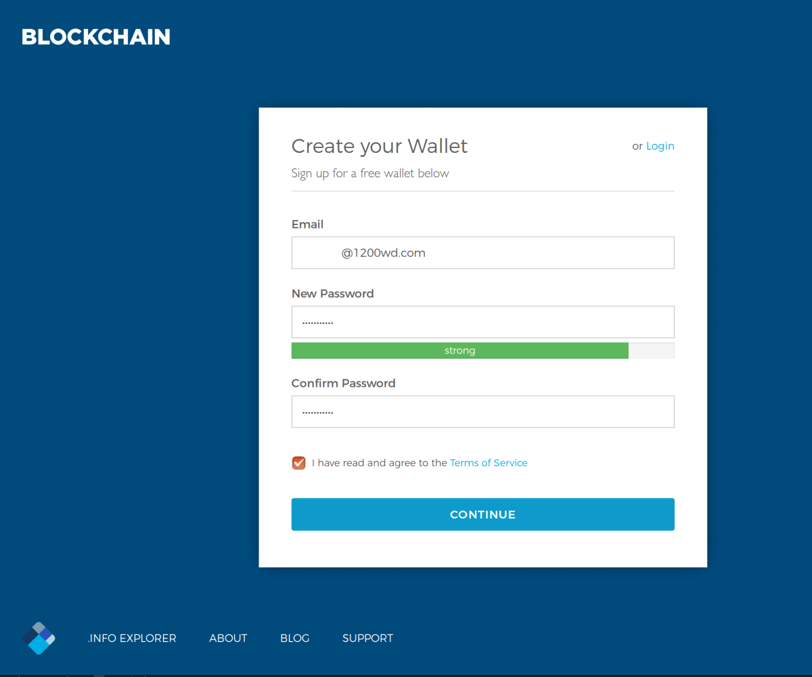

Create a Blockchain.info Wallet
===============================

:date: 2017-06-01 14:36
:modified: 2017-06-01 14:36
:tags: bitcoin, wallets
:category: Paper Wallets
:slug: create-blockchain-info-wallet
:authors: Lennart Jongeneel
:summary: Step-by-step instruction guide to create Blockchain.info wallet and transfer funds from your paper wallet
:language: en

.. _create-blockchain-info-wallet:

Go to https://blockchain.info/wallet/ and create an account with your email and password.

Now go to security settings to verify your email. You can disable TOR if you do not use it.

Next backup your passphrase by writing down the 12 words on a piece of paper and store them
in a safe place. You can restore you wallet in case you have forgotten your password,
or if Blockchain.info might disappear. But anyone who
finds this paper can also use your bitcoins.

.. image:: images/blockchain-info-security-settings.png
   :width: 1200px
   :alt: Blockchain.info security settings
   :align: center

Thats all, your wallet is ready! You can continue to
`import a paper wallet <{filename}/paper-wallet-import-blockchain-info.rst>`_
or buy some bitcoins.

