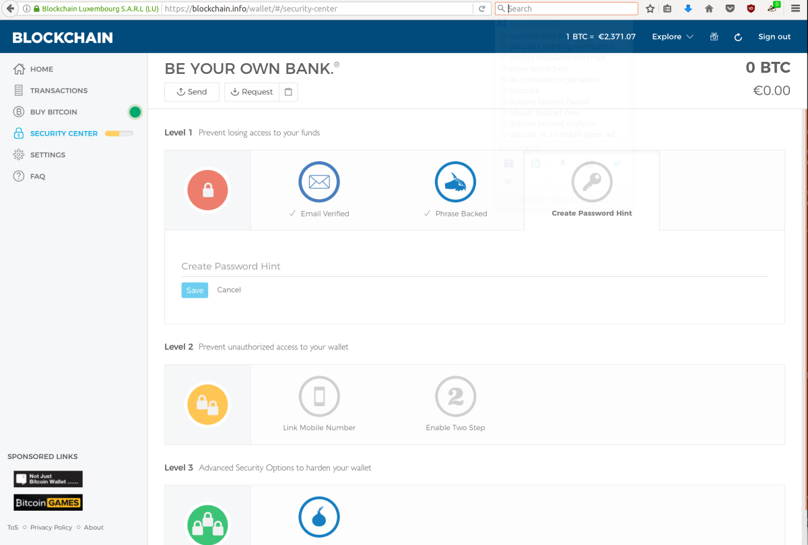
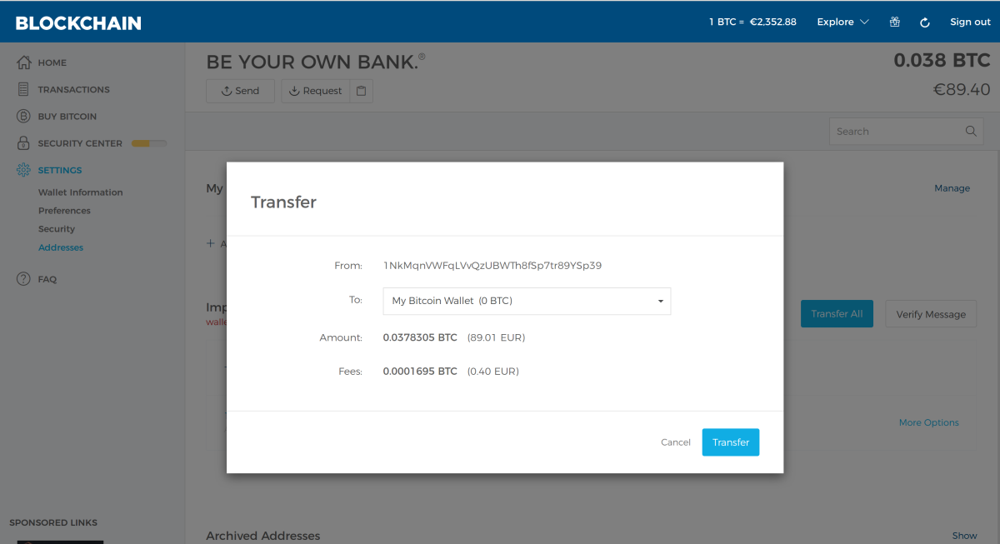

Create a Blockchain.info Wallet
===============================

:date: 2017-06-01 14:36
:modified: 2017-06-01 14:36
:tags: bitcoin, wallets
:category: Paper Wallets
:slug: create-blockchain-info-wallet
:authors: Lennart Jongeneel
:summary: Step-by-step instruction guide to create Blockchain.info wallet and transfer funds from your paper wallet
:language: en

.. _create-blockchain-info-wallet:

Go to https://blockchain.info/wallet/ and create an account with your email and password.

.. image:: images/blockchain-info-create.png
   :width: 1200px
   :alt: Create wallet on Blockchain.info
   :align: center

Now go to security settings to verify your email and backup your passphrase.

To import your paper wallet go to the settings menu and select addresses. Then click on
import address and enter your private key. The private key will be validated and the funds
from your paper wallet will be transferred to the Blockchain.info wallet. If you want to
send coins from your Blockchain wallet right away, use priority fee, otherwise you might have
to wait a couple or hours.

Please note: Normally never enter your private key on any website! However blockchain.info is well
known and established, and their website is set up in such a way that your private keys are
not send to their servers. However for larger amount of bitcoins and / or long term storage I
would advice to use a local hardware or software wallet.

Congratulations, you have now transferred the bitcoins to your Blockchain.info wallet.

