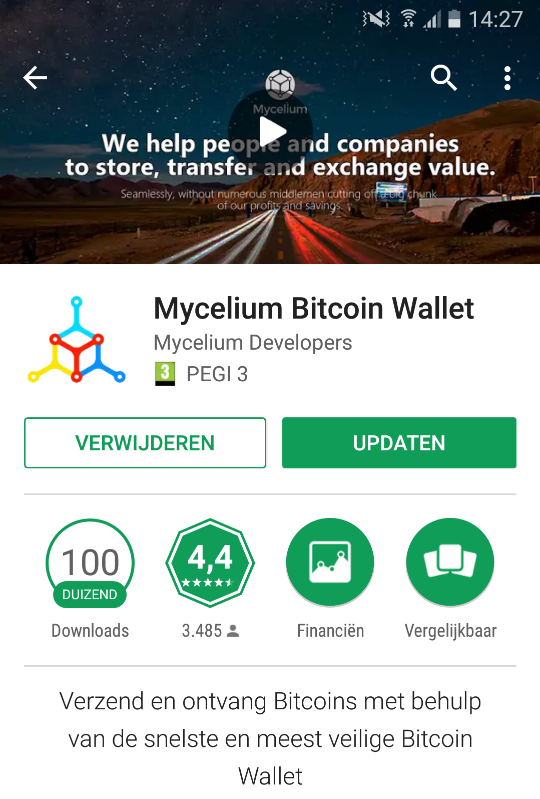
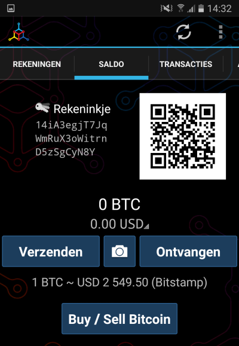
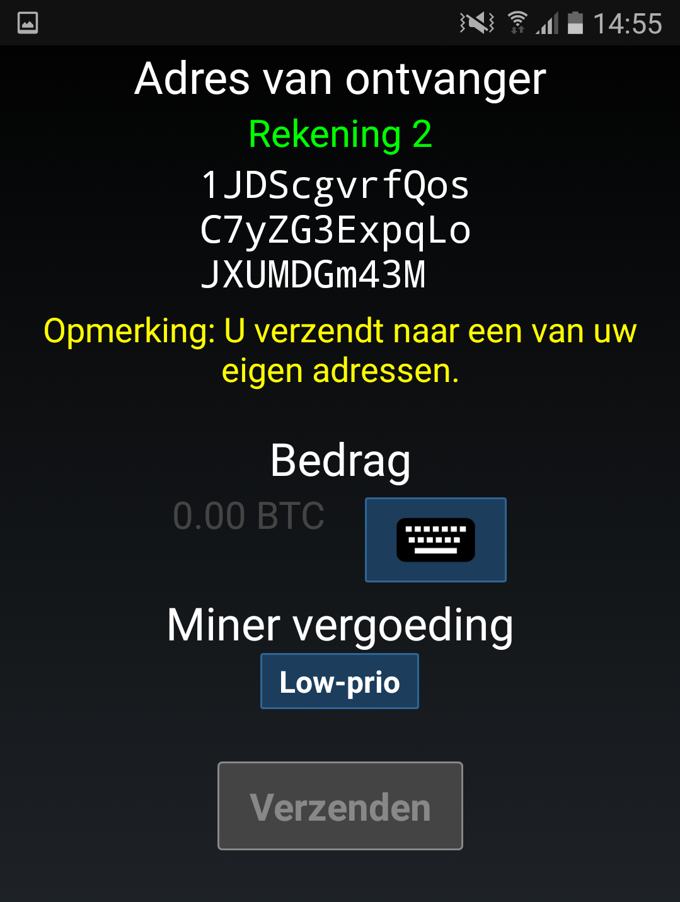
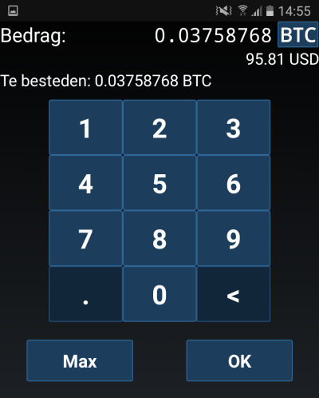
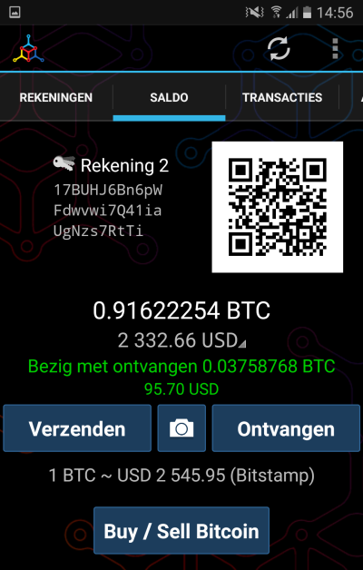

Create Mycelium Wallet
======================

:date: 2017-06-01 14:36
:modified: 2017-06-01 14:36
:tags: bitcoin, wallets
:category: Paper Wallets
:slug: create-mycelium-wallet
:authors: Lennart Jongeneel
:summary: Step-by-step instruction guide to create a Mycelium wallet and transfer funds from your paper wallet
:language: en

.. _create-mycelium-wallet:

Go to Google Play and install the Mycelium bitcoin wallet.

Follow the instructions and create a HD Wallet, be sure to write down the private key and store it in
a safe place. This key can be used to restore your bitcoins in case your phone is broken or lost.

You have created a bitcoin wallet with a HD account, go to the second tab to open your account.

Continue to import your private wallet. Select 'Cold storage' (= Paper wallets)
from the main menu and then select 'QR code'
to scan the Private key from your paper wallet.

Now you are ready to create the transaction. Be sure to select an address from you own wallet.
You should see a warning: You are sending a payment to your own address.

It is advised to take all the bitcoins of the paper wallet in one transaction. To do
this click on the keyboard and select 'max'. In case you are not in a hurry you can
select 'low-prio' from the miner fee selection.

Now you are ready to spend your bitcoins!

