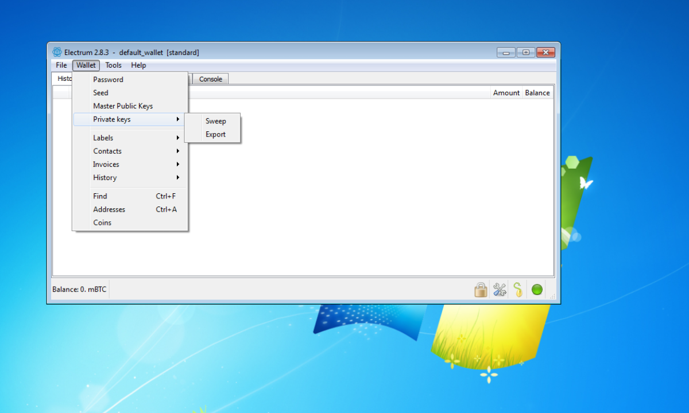
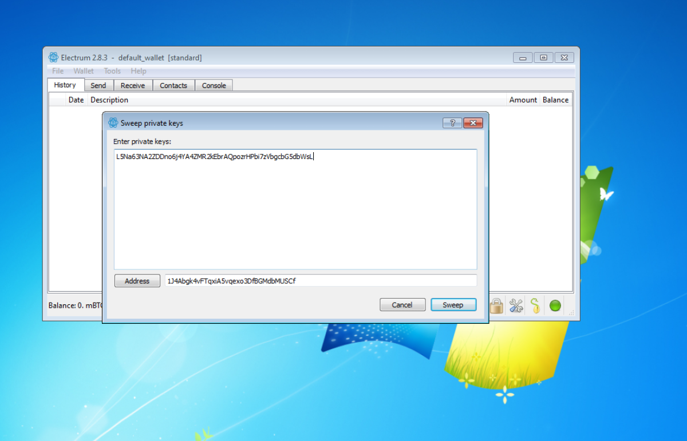
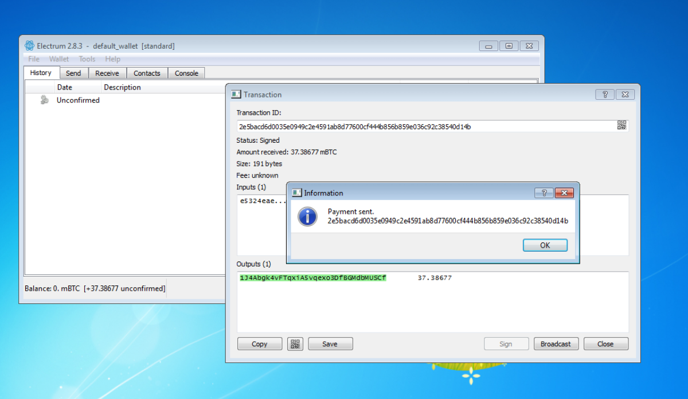
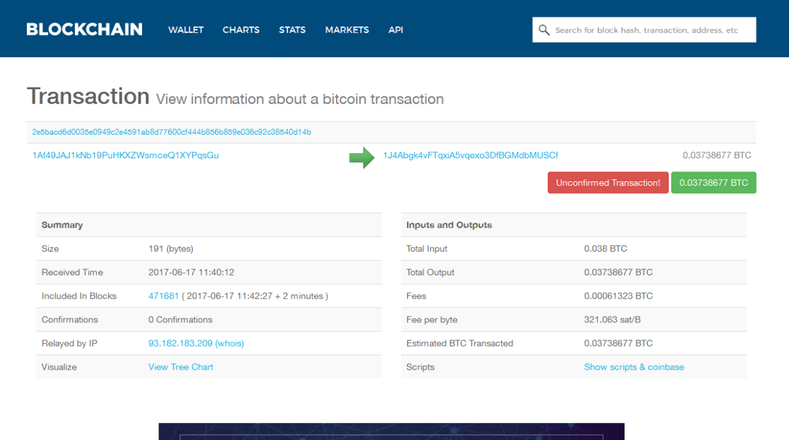

Import a paper wallet into Electrum
===================================

:date: 2017-06-01 14:36
:modified: 2017-06-01 14:36
:tags: bitcoin, wallets
:category: Paper Wallets
:slug: paper-wallet-import-electrum
:authors: Lennart Jongeneel
:summary: How to import (or sweep) a paper wallet into Electrum
:language: en

.. _paper-wallet-import-electrum:

You have
`installed a Electrum wallet <{filename}/create-electrum-wallet.rst>`_.
Open your wallet and follow the instruction
to transfer the funds from your paper wallet.
Go to the Wallets menu and select 'Private Keys' and the 'Sweep'

Now enter the private key. Yes you have to type it over from your paper wallet.
Another option is to scan the QR code with your webcam or phone and send it to your PC,
but this is not very safe.

If you entered the private key correctly, you will be able to sweep it, or in other words:
transfer the bitcoins from your paper wallet to Electrum.

Click on Broadcast to push the transaction to the network and start the transfer.

You should see an unconfirmed transaction in your wallet. The only thing you have to do
know is wait, it can take from a couple of minutes to hours -depending on the fee- before
you transaction is confirmed. You do not have to stay online for the transfer,
you can safely exit your wallet.

The bitcoin blockchain where all bitcoin transactions are stored is public, so can go
to a block explorer website such as https://blockchain.info and search for your
transaction.

Now while have your bitcoins on your PC you can
`sell some of them on Bitonic <|filename|sell-bitcoins-on-bitonic.rst>`_
, `go shopping <http://bitcoinspot.nl/waar-kan-je-in-nederland-met-bitcoins-betalen/zoo-frontpage.html>`_
or
`install a Mycelium Wallet <{filename}/create-mycelium-wallet.rst>`_
to be able to scan QR-codes for easier payments.
