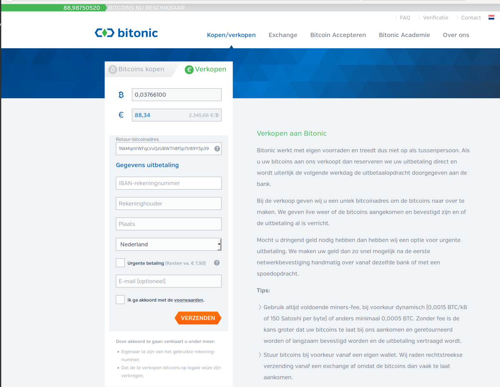
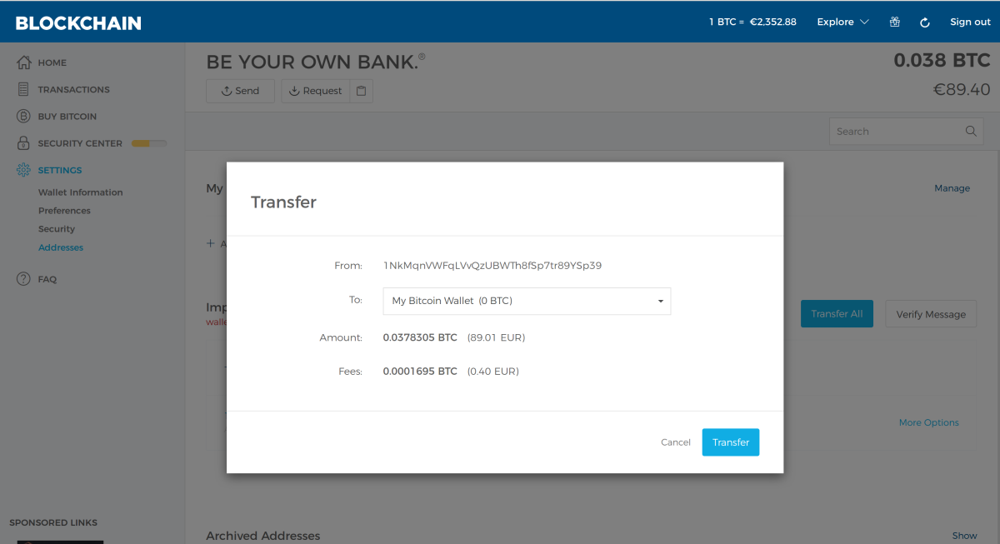
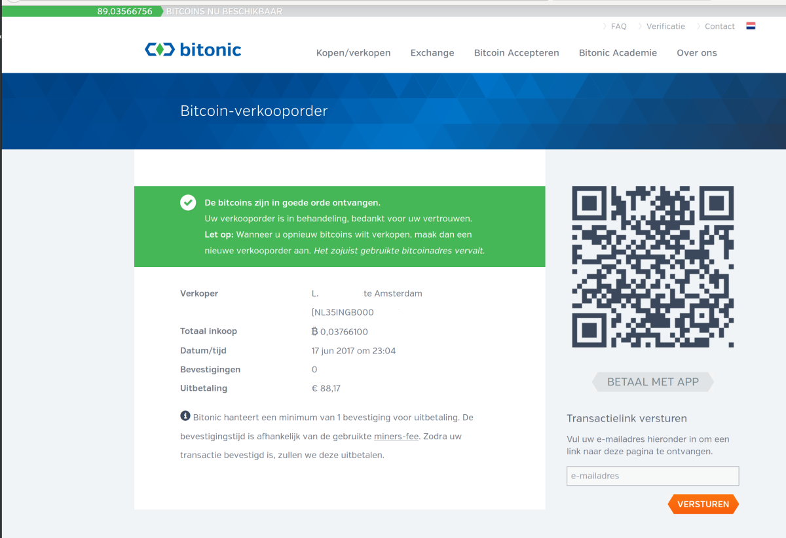

How to sell bitcoins on Bitonic
===============================

:date: 2017-06-01 14:36
:modified: 2017-06-01 14:36
:tags: bitcoin, wallets
:category: Paper Wallets
:slug: sell-bitcoins-on-bitonic
:authors: Lennart Jongeneel
:summary: How to sell bitcoins on Bitonic
:language: en

.. _sell-bitcoins-on-bitonic:

Login to your `Blockchain.info Wallet <{filename}/create-blockchain-info-wallet.rst>`_
or open another wallet you own and go to https://bitonic.nl

Fill in the amount of bitcoins you would like to sell and the return bitcoin address.
The bitcoin address can be same address as you send the bitcoins from, or you can request
a new address from your wallet if you are concerned about privacy.

If you would like to sell the full amount please do not forget to deduct the transaction fees.
So transfer the full amount of your wallet minus the expected transaction fees. You can
find the expected transaction fee when you click on 'Send' in the Blockchain.info wallet.

Then fill in your name and bank account number, and also advisedly also your email address.
Now you will receive a bitcoin address and you can transfer the bitcoins from your wallet
to Bitonic. You do not need to include a priority fee, as a standard fee is enough to get
your transaction through in a couple of hours normally.

Now you have sold your bitcoins and they will be transferred to your bank account the next
business day.
