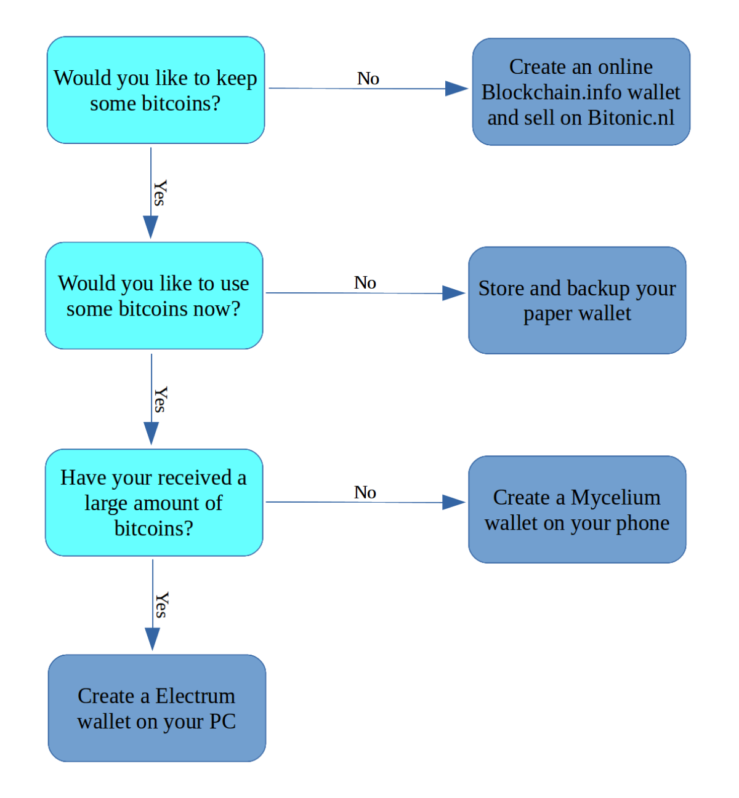

What to do with my paper wallet?
================================

:date: 2017-07-01 14:36
:modified: 2017-07-01 14:36
:tags: bitcoin, wallets
:category: Paper Wallets
:slug: what-to-do-with-my-paper-wallet
:authors: Lennart Jongeneel
:summary: Step-by-step instruction guide if you have received a paper wallet
:language: en

Nice, you have just received a paper wallet with bitcoins! After reading this page you know what do
with them, but whatever you do please keep this in mind:

* If you lose this paper and did not make a copy your bitcoins are lost forever
* Anyone who has access to the private key on this paper, can steal your bitcoins

Decision Tree
-------------

Option 1: Create an online wallet and sell
------------------------------------------

There are several online wallets out there and numerous places where you can sell
your bitcoins. Follow this guide on
`how to create Blockchain.info Wallet <{filename}/create-blockchain-info-wallet.rst>`_
. It is easy to setup, requires no ID verification and it is safe.

Once you have `made the transfer from your paper wallet <|filename|paper-wallet-import-blockchain-info.rst>`_
to the online wallet you can
`sell your bitcoins on Bitonic <|filename|sell-bitcoins-on-bitonic.rst>`_
and they will be transferred in Euro's within 1 business day to any IBAN bank account.

Option 2: Do nothing and just store this paper
----------------------------------------------

With the private key on the paper wallet you can unlock your bitcoins and use them.
If you do nothing the private key will remain valid and the bitcoins will remain on
the same place. You can just wait to see the value increase or decrease compared to
the Euro or another currency.

The disadvantages of this are that your paper wallet can be stolen, lost, burned or
eaten by you dog and there is no way to recover them. So please make sure to make a
number of copies and put them where bad people cannot find them.

Also note that you have to trust the issuer of the paper wallet, you have no guarantees
he or see does not have a copy of the private key and thus can also spend your bitcoins.

If you want to use your bitcoins to sell them, exchange or spend them or maybe put
them in a safer place you need to create another wallet.

Option 3: Create an Mycelium Wallet on your Phone
-------------------------------------------------

Installing a software wallet on your phone is easy, and the Mycelium wallet is very user friendly.
Keep in mind that most phones are easy to hack so do not keep more bitcoins on there than you
would keep in your pocket wallet.

`Create a Mycelium Wallet <{filename}/create-mycelium-wallet.rst>`_
and then transfer the funds from
`your paper wallet to Mycelium <{filename}/paper-wallet-import-mycelium.rst>`_.

Option 4: Install Electrum on your PC
-------------------------------------

If you have received a larger amount of bitcoins or you want to learn and experiment more
`install the Electrum Wallet <{filename}/create-electrum-wallet.rst>`_

With this wallet you have a lot of control and there is broad range of functionality but it
still safe to use.

`Import the paper wallet in Electrum <{filename}/paper-wallet-import-electrum.rst>`_
by sweeping it. Which means all the bitcoins are transferred at once.

Or any combination of the options above
---------------------------------------

Of course you don't have to restrict yourself to one of this options, you can combine them.
For instance you could sell the largest part on Bitonic and then put a smaller amount
on your phone to buy pizza once in a while. Or split it between a user wallet on your phone
a long term investment wallet on your PC.

And as final remark: there are more wallets and places to buy or sell bitcoins out there.
I choose those because I know them and think they are good beginner options. But please
look around yourself and experiment with other bitcoin websites or software.

A good place to learn more about bitcoin is https://bitcoin.org
